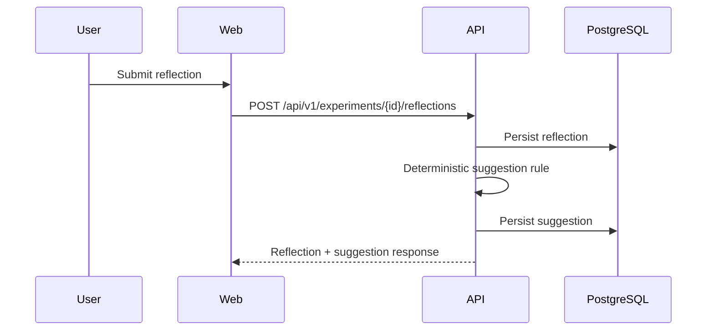

# Runtime View

Initial vertical slice sequence:

```mermaid
sequenceDiagram
  participant U as User
  participant W as Web
  participant A as API
  participant D as PostgreSQL

  U->>W: Submit reflection
  W->>A: POST /api/v1/experiments/{id}/reflections
  A->>D: Persist reflection
  A->>A: Deterministic suggestion rule
  A->>D: Persist suggestion
  A-->>W: Reflection + suggestion response
```
